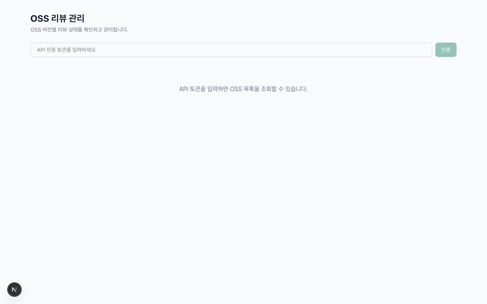
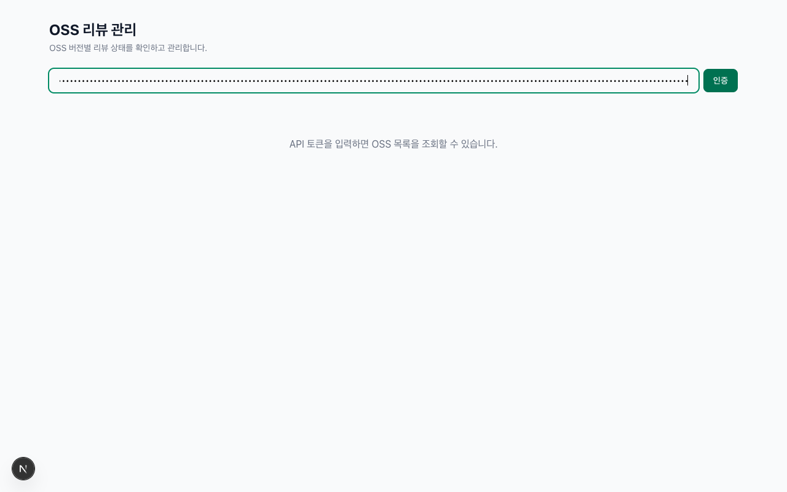
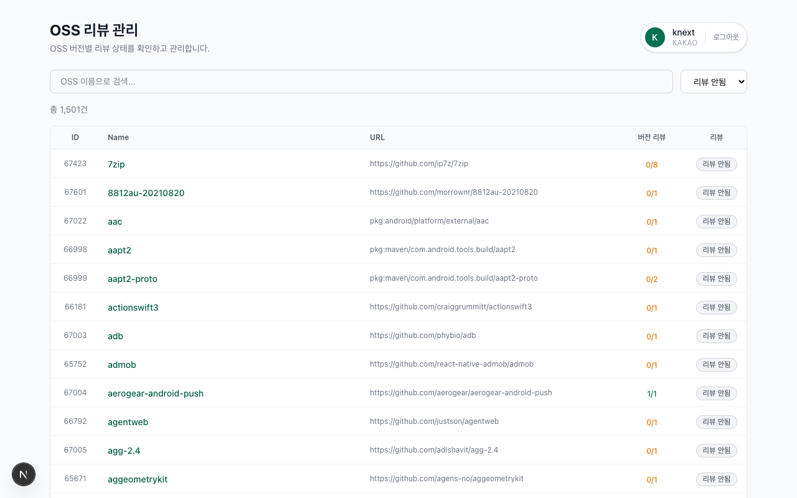
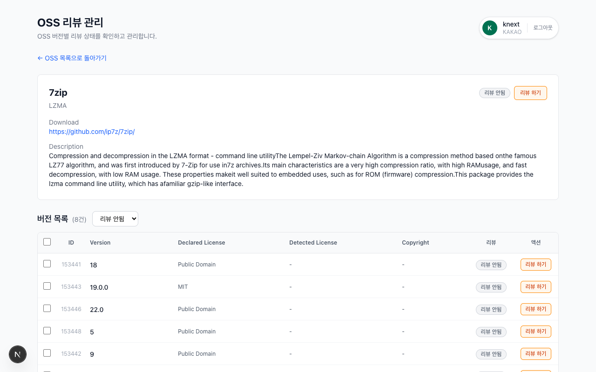
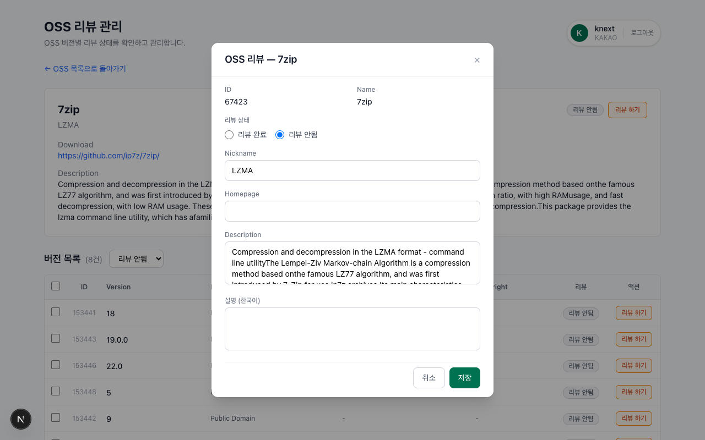
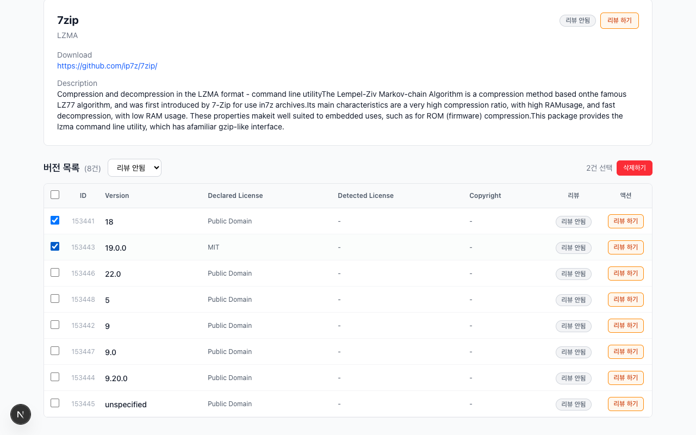
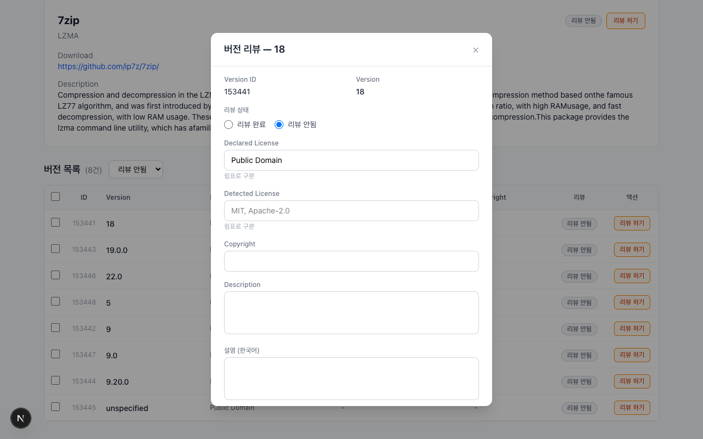

# OSS Review (osori_review)

OSORI OSS 버전별 리뷰 상태를 확인하고 관리하는 웹 애플리케이션입니다.

## 기술 스택

- **Framework**: Next.js 16 (App Router)
- **UI**: React 19 + Tailwind CSS 4
- **Language**: TypeScript 5
- **Validation**: Zod 4
- **Testing**: Vitest + Testing Library
- **Theme**: OLIVE UI 기반 녹색 계열

## 시작하기

### 사전 요구사항

- Node.js 21+
- npm

### 설치 및 실행

```bash
# 의존성 설치
npm install

# 개발 서버 실행
npm run dev

# 프로덕션 빌드
npm run build
npm start
```

개발 서버: http://localhost:3000

### Docker 실행

```bash
# 이미지 빌드
docker build -t osori-review .

# 컨테이너 실행
docker run -p 3000:3000 osori-review
```

http://localhost:3000 으로 접속합니다.

### 테스트

```bash
# 테스트 실행
npm test

# 테스트 워치 모드
npm run test:watch
```

## 주요 기능

### 1. API 토큰 인증

앱 실행 시 OSORI API 인증 토큰을 입력하여 인증합니다. 토큰은 JWT 형식이며, sessionStorage에 저장됩니다.



토큰 입력 후 인증 버튼을 클릭하면 사용자 정보가 헤더에 표시됩니다.



### 2. OSS 목록

인증 후 OSS 목록이 테이블 형태로 표시됩니다. ID, 이름, URL, 버전별 리뷰 진행률, 리뷰 상태를 한눈에 확인할 수 있습니다.

- 이름 검색
- 리뷰 상태 필터 (전체 / 리뷰 완료 / 리뷰 안됨)
- 페이지네이션 (20건 단위)



### 3. OSS 상세 + 버전 목록

OSS 이름을 클릭하면 상세 페이지로 이동합니다. 상단에 OSS 기본 정보, 하단에 버전 목록이 표시됩니다.



### 4. OSS 리뷰 모달

OSS 상세에서 "리뷰 하기" 버튼을 클릭하면 리뷰 모달이 열립니다. 리뷰 상태 변경과 함께 Nickname, Homepage, Description 등을 수정할 수 있습니다.



### 5. 버전 선택 및 일괄 삭제

버전 목록에서 체크박스로 항목을 선택하면 빨간색 "삭제하기" 버튼이 나타납니다. 클릭 시 확인 다이얼로그를 거쳐 선택한 버전을 일괄 삭제합니다.



### 6. 버전 리뷰 모달

각 버전의 "리뷰 하기" 버튼을 클릭하면 버전 리뷰 모달이 열립니다. Declared License, Detected License, Copyright, Description 등을 수정할 수 있습니다.



## 프로젝트 구조

```
src/
├── app/                    # Next.js App Router 페이지
│   ├── api/                # API 프록시 라우트 (외부 API 중계)
│   │   ├── oss/            # OSS 마스터 API
│   │   └── oss-versions/   # OSS 버전 API (CRUD + 일괄 삭제)
│   ├── oss/[id]/           # OSS 상세 페이지
│   ├── layout.tsx          # 루트 레이아웃
│   └── page.tsx            # 메인 페이지 (OSS 목록)
├── components/             # React 컴포넌트
│   ├── AuthTokenInput.tsx  # 토큰 입력 폼
│   ├── Header.tsx          # 헤더 (사용자 정보 + 로그아웃)
│   ├── Modal.tsx           # 범용 모달 컴포넌트
│   ├── OssList.tsx         # OSS 목록 (검색, 필터, 페이지네이션)
│   ├── OssListItem.tsx     # OSS 목록 행
│   ├── OssDetail.tsx       # OSS 상세 정보
│   ├── OssReviewModal.tsx  # OSS 리뷰/수정 모달
│   ├── VersionList.tsx     # 버전 목록 (선택, 필터, 일괄 삭제)
│   ├── VersionItem.tsx     # 버전 목록 행
│   ├── VersionReviewModal.tsx  # 버전 리뷰/수정 모달
│   ├── StatusBadge.tsx     # 리뷰 상태 배지
│   ├── Pagination.tsx      # 페이지네이션
│   ├── LoadingSkeleton.tsx # 로딩 스켈레톤
│   └── ErrorMessage.tsx    # 에러 메시지
├── contexts/
│   └── AuthContext.tsx      # 인증 컨텍스트 (sessionStorage)
├── hooks/
│   ├── useAuth.ts          # 인증 훅
│   ├── useOssList.ts       # OSS 목록 데이터 훅
│   └── useOssVersions.ts   # OSS 버전 데이터 훅
└── lib/
    ├── api-client.ts       # 내부 API 클라이언트
    ├── external-api.ts     # 외부 API 프록시 유틸
    └── types.ts            # TypeScript 타입 정의
```

## API 아키텍처

```
브라우저 → Next.js API Routes → OSORI 외부 API (https://olis.or.kr:16443)
```

Next.js API Routes가 프록시 역할을 하여 외부 API와 통신합니다. 주요 엔드포인트:

| 내부 경로 | 외부 경로 | 설명 |
|-----------|-----------|------|
| `GET /api/oss` | `GET /api/v2/admin/oss` | OSS 목록 조회 |
| `GET /api/oss/:id` | `GET /api/v2/admin/oss/:id` | OSS 상세 조회 |
| `PUT /api/oss/:id` | `PUT /api/v2/admin/oss/:id` | OSS 수정 |
| `GET /api/oss-versions` | `GET /api/v2/admin/oss-versions` | 버전 목록 조회 |
| `PUT /api/oss-versions/:id` | `PUT /api/v2/admin/oss-versions/:id` | 버전 수정 |
| `POST /api/oss-versions/bulk-delete` | `DELETE /api/v2/admin/oss-versions/:id` (each) | 버전 일괄 삭제 |
